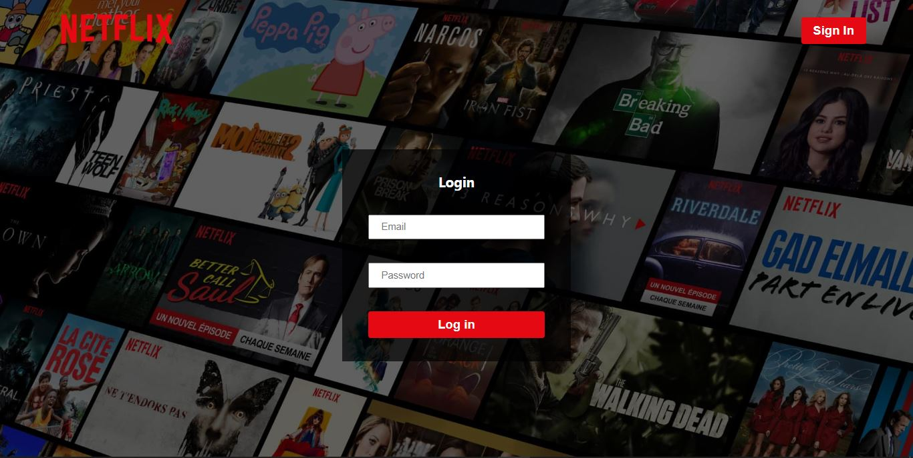
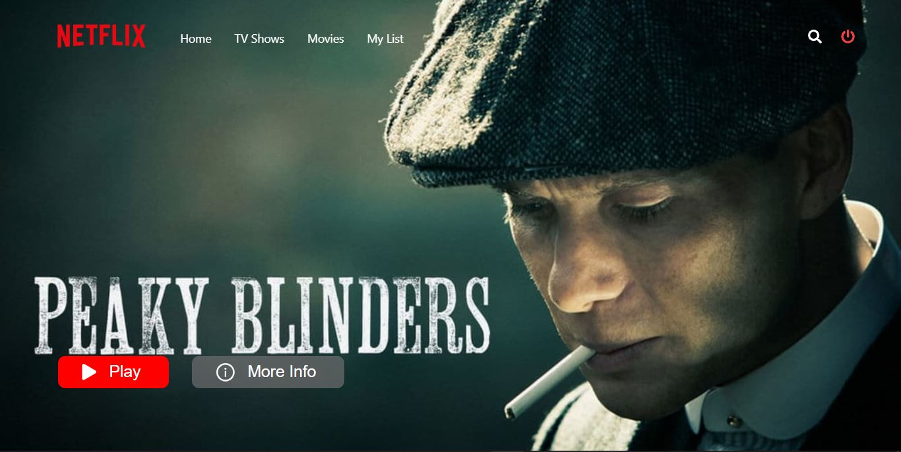
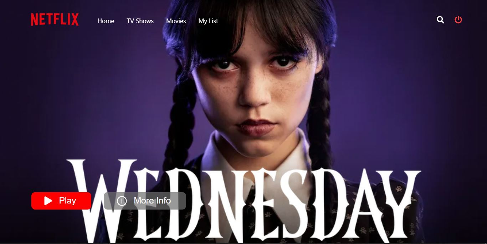
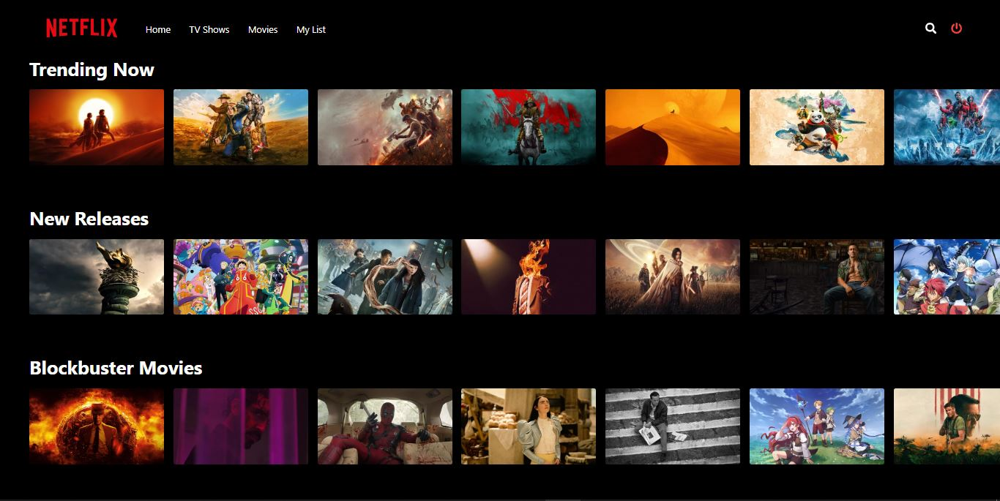
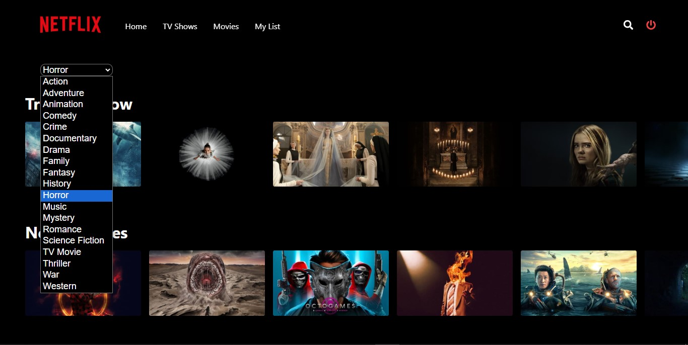
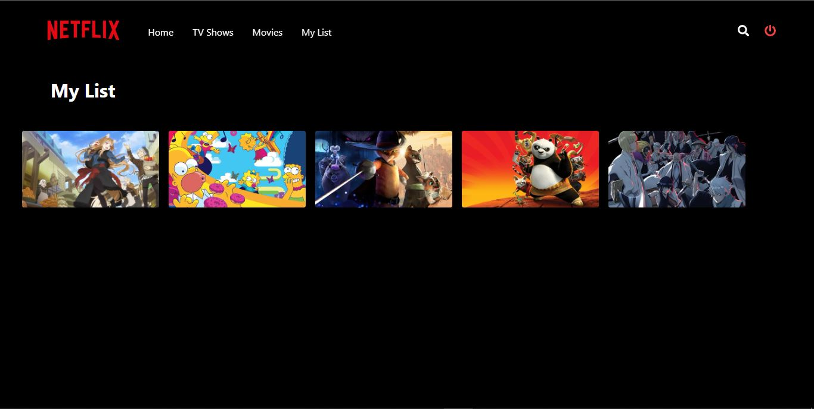

# Netflix App Clone

## Description
Welcome to an immersive entertainment experience like no other! Dive into the world of unlimited movies and TV shows with our Netflix-inspired app clone. Indulge in seamless navigation with our sleek user interface, featuring a dynamic homepage adorned with a captivating slider showcasing the latest and greatest in cinematic delights.

Unlock the full potential of personalized viewing with our signup and login functionality, allowing you to curate your own movie list tailored to your unique tastes. Explore a vast library of content spanning across genres, from heart-pounding action to heartwarming romance, and everything in between.

With our intuitive genre selection feature, discovering new favourites has never been easier. Simply choose your preferred genre, sit back, and let our app curate a custom viewing experience just for you.

Experience the future of entertainment today with our Netflix app clone. Elevate your downtime, escape into a world of endless possibilities, and let the magic of cinema unfold at your fingertips.

## Demo

[Live Demo](https://github.com/Kundan10424/Netflix)

## Installation
1. Clone the repository: `git clone https://github.com/your-username/netflix-app.git`
2. Navigate to the project directory: `cd netflix-app`
3. Install dependencies: `npm install`

## Usage
1. Start the development server: `npm start`
2. Open your browser and go to `http://localhost:3000`

## Features
- Signup and login functionality
- Responsive navbar
- Slider for featured movies
- Add movies to your list
- Genre selection

## Contributing
Contributions are welcome! Please feel free to submit a pull request or open an issue for any bugs or feature requests.
